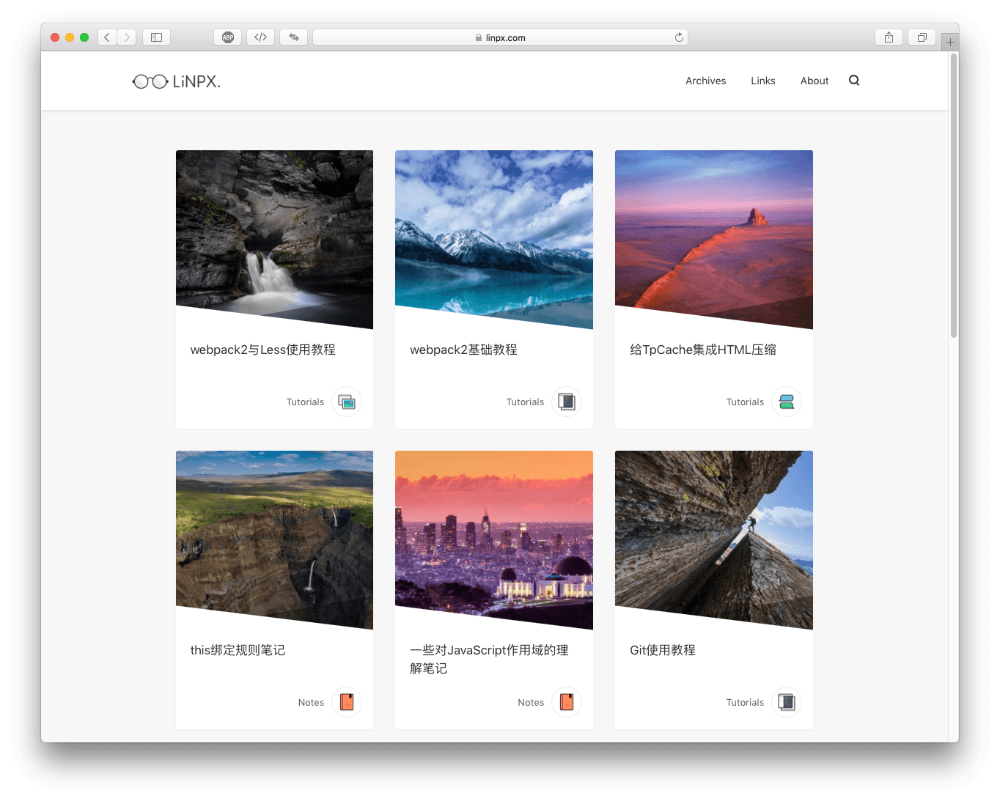
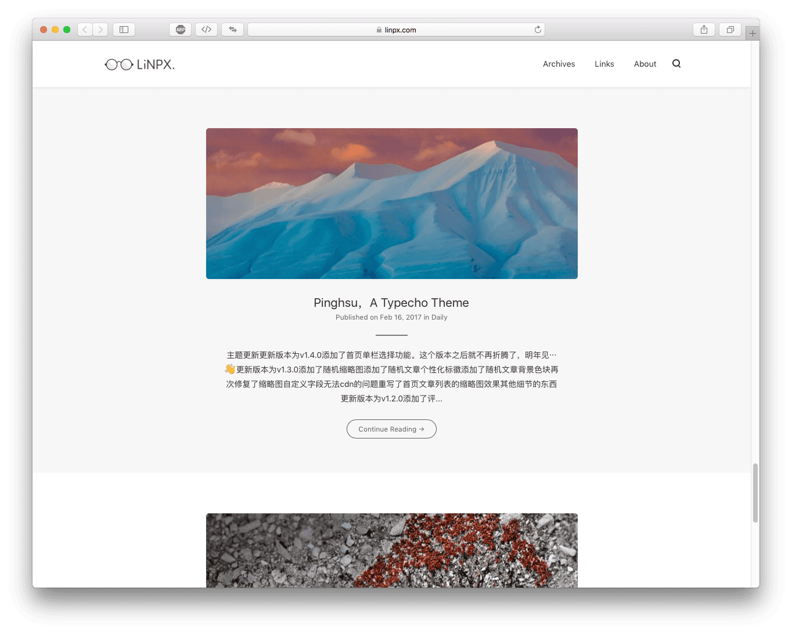
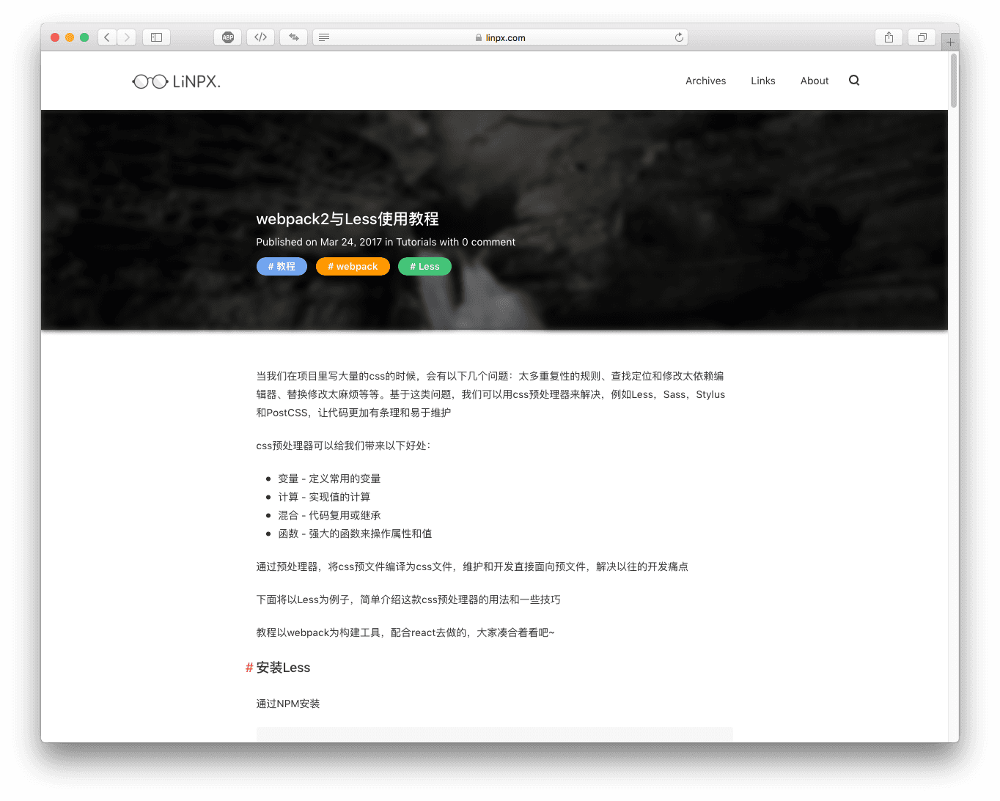
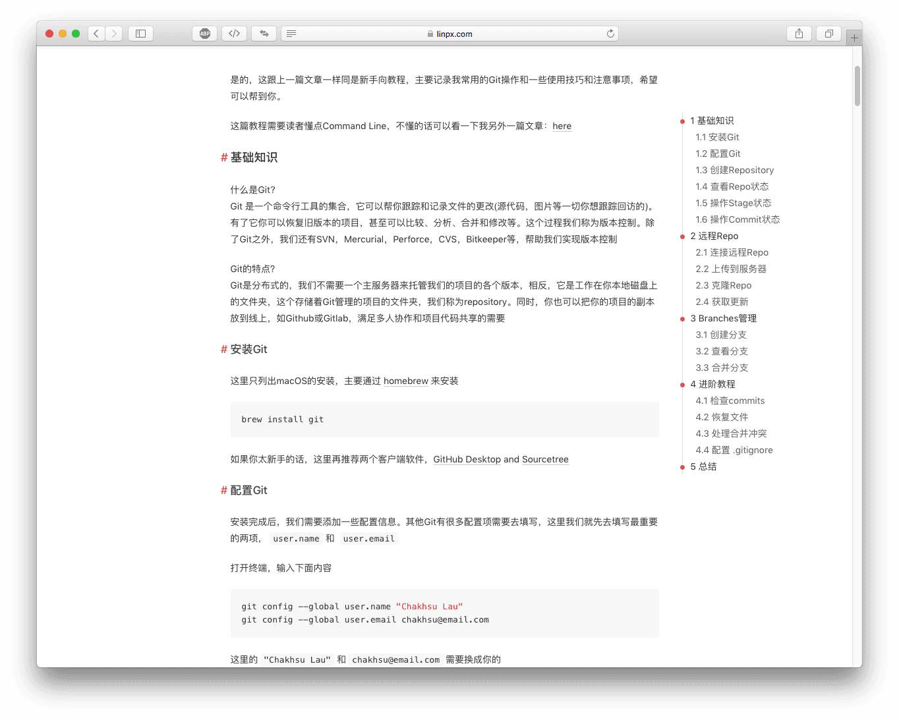
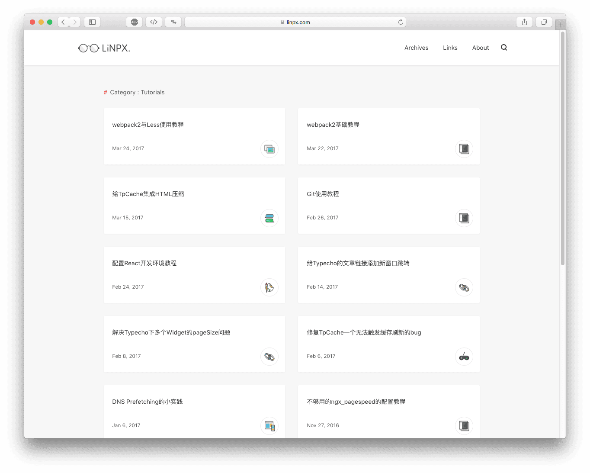
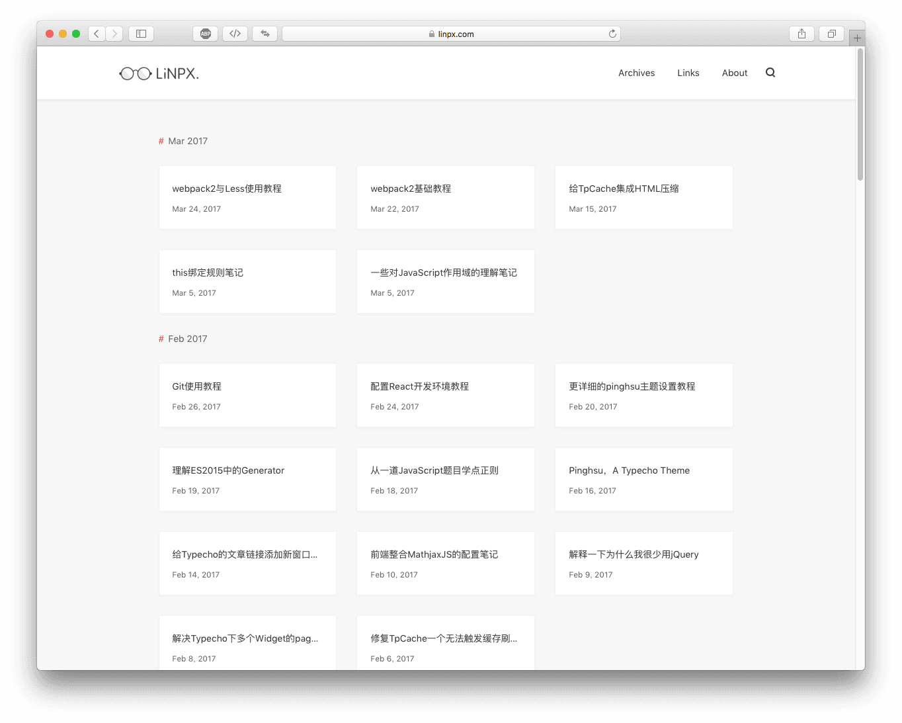
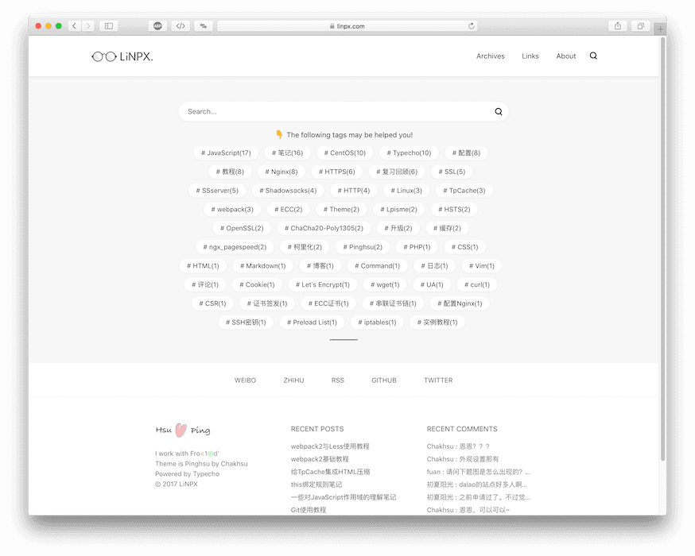
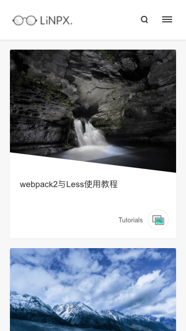
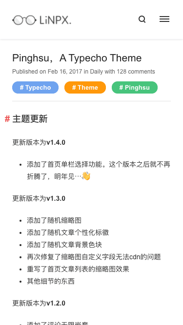
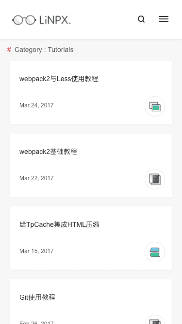

## Pinghsu Theme

[简体中文](README.md)
[English](README_en.md)

**Theme Introduction**

Pinghsu is a Typecho theme designed with a focus on frontend performance optimization while also considering aesthetic design and visual communication. The theme's name is a combination of the last letters of the author's name and his girlfriend's name in Hong Kong English, struggling between "Hsuping" and "Pinghsu." Eventually, it became Pinghsu, meaning everything is "Ping" (first) and then "Hsu" (last), indicating the need to listen to his girlfriend.

**Download Link**

https://github.com/chakhsu/pinghsu

**Theme Preview**

https://www.linpx.com

## Theme Highlights

 - Page preloading and DNS prefetching ensure extremely fast access speed.
 - No JQuery, no frontend frameworks, lightweight.
 - Almost zero code redundancy, almost every line of code is meaningful.
 - HighlightJS code highlighting, supporting 22 programming languages.
 - Responsive design, supporting tablets and mobile phones, with a browsing experience even better than desktop.
 - Supports image CDN mirroring, supports various article thumbnail settings.
 - Supports choosing between three-column and single-column homepages, article banners, and color blocks.
 - Supports article table of contents, related articles, and rendering of mathematical formulas.
 - Supports personalized badge settings for articles, with 10 badge choices.
 - Supports personal social buttons and social sharing.
 - XSS detection and prevention of multiple comment submissions added to theme settings.
 - And many more highlights waiting for you to discover!

## More Previews

|Homepage - Three Columns|Homepage - Single Column|
|:------|:------|
|||

|Article Content Page - Banner|Article Content Page - Table of Contents|
|:------|:------|
|||

|Page Content Page|Content Page - Comments|
|:------|:------|
|||

|Category Page|Template Archive Page|
|:------|:------|
|||

|Search Page|404|
|:------|:------|
|||

|Mobile - Homepage|Mobile - Article Page|Mobile - Category Page|
|:------|:------|:------|
||||

## Theme Usage

**Note**: Currently, the theme has only been tested on the Typecho development version and PHP 7.0. Other scenarios have not been extensively tested.

Download from Github by clicking "Download ZIP", then after extraction, rename the folder to `pinghsu`, upload it to `/usr/themes`, and activate the theme.

If you need to update the theme, download the latest files, then overwrite the original files to complete the update. Some newly added features need to be enabled in the backend to take effect.

## Appearance Settings

Appearance settings are mainly divided into four parts: logo and icon settings, feature toggles, social button settings, and image CDN mirroring.

The usage notes are fairly clear in the settings. If you encounter any unclear points, feel free to leave me a message for feedback.

Here are a few additional points:

 - CDN settings have only been tested with Qiniu, theoretically also supporting CDN services with mirroring capabilities.
 - When creating a template archive page, regardless of which template is chosen, you must add the custom field `archive`.

**Separate Search Page**

Check here for setup instructions: [Here](https://www.linpx.com/p/add-a-separate-search-page-to-the-pinghsu-theme.html)

**Article Thumbnails**

There are four methods for setting article thumbnails: custom field `thumb`, the first image attachment, images within the article, default thumbnails.

Priority order: custom field thumb -> first image attachment -> images within the article -> default thumbnail -> random image -> none.

Thumbnail dimensions should be at least 250px in height, with a width greater than the height. A recommended height is 400px.

**Personalized Badges**

Personalized badges appear on the homepage, category pages, tag pages, author pages, and related articles.

The method for setting badges is to fill in custom fields while editing the article. Supported fields include:

`book`, `game`, `note`, `chat`, `code`, `image`, `web`, `link`, `design`, `lock`

**Personalized Color Blocks**

To activate personalized color blocks, you need to enable them in the appearance settings. Color blocks appear on the homepage, category pages, tag pages, separate search pages, and more.

The method for setting color blocks is to fill in custom fields while editing the article. Supported fields include:

`blue`, `purple`, `green`, `yellow`, `red`

**Friendship Links**

If you want to create a friendship links page like mine, since it's the Typecho development version, it supports writing `<ul><li>` within a page.

So you can directly inline a `class="flinks"` within `<ul>`, then insert your friendship links within `<li>`.

More setup tutorials: [Here](https://www.linpx.com/p/more-detailed-pinghsu-theme-set-tutorial.html)

## Browser Compatibility

Well... modern browsers are all compatible...

## Contributing

All kinds of contributions (enhancements, new features, documentation & code improvements, issues & bugs reporting) are welcome.

## License

Open sourced under the MIT license.
